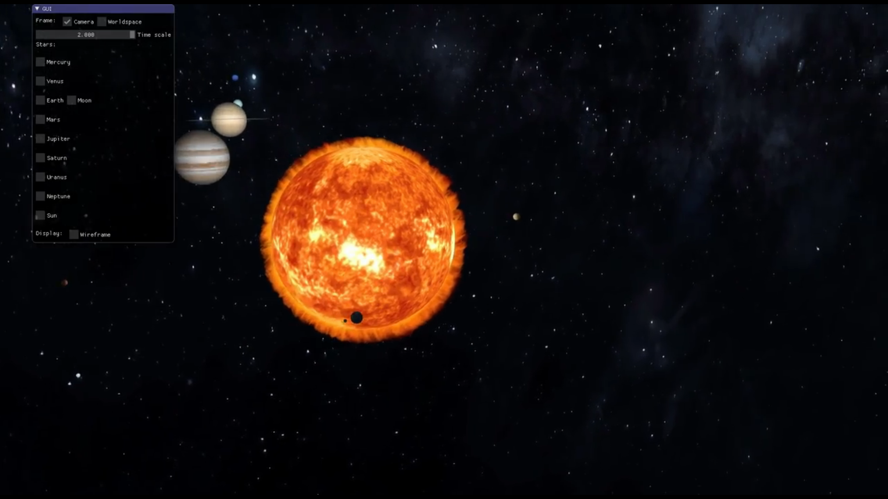

# Solar System

<!-- PROJECT LOGO -->
 

  <h3 align="center">Solar System 3D Modelization</h3>
  

    An animation by simulation
  

<!-- TABLE OF CONTENTS -->

  
Table of Contents

  <ol>
    <li>
      <a href="#about-the-project">About The Project</a>
      <ul>
        <li><a href="#built-with">Built With</a></li>
      </ul>
    </li>
    <li>
      <a href="#getting-started">Getting Started</a>
      <ul>
        <li><a href="#prerequisites">Prerequisites</a></li>
      </ul>
    </li>
    <li><a href="#usage">Usage</a></li>
    <li><a href="#license">License</a></li>
    <li><a href="#contact">Contact</a></li>
  </ol>

<!-- ABOUT THE PROJECT -->
## About The Project

This project aims to practice some VCL techniquess and C++ programming for 3D Modelisaiton. The base project is offered by __École Polytechnique de Paris__. This is an evaluated __personal project__ with __educational purposes__.
The base work is provide by École Polytechnique, and the _solarsystem_ scene is the main target for this project. 
See: [Solar system scenes](https://github.com/scarllethcastro/SolarSystem/tree/master/scenes/3D_graphics/SolarSystem)

### Built With
To make this project, we used some API's such as:
* [OpenGL](https://www.opengl.org/)

<!-- GETTING STARTED -->
## Getting Started

### Prerequisites
_TODO: include prerequisites_ 

<!-- USAGE EXAMPLES -->
## Usage
The scene is an animation by simulation. The simulation used is the Classical Gravity. The sun is considered fix and the size of the planets are unscaled: planets ratio are 1000 times bigger than their normal sizes (considering their distances), in order to produce a good looking model. The sun, though, is also augmented, but a little less, so the proportion between planets and sun's ratio are also not real.

The orbits, in the other hand, are scaled and respect the proportions, since it is an result of the dynamic system.

_TODO: include small video_

Preview:

<!-- LICENSE -->
## License

Distributed under the MIT License. See `LICENSE` for more information.

<!-- CONTACT -->
## Contact
Marcelo Correa - marcelosancorr@gmail.com

Scarlleth Castro - cacaucastromsgc@gmail.com

Project Link: [https://github.com/marcelosancor/TripTelling](https://github.com/scarllethcastro/SolarSystem)
